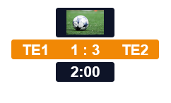

# Design a zagreus template
When creating a zagreus template the main visual elements are designed and created with the help of HTML, CSS and Javascript (JS). It is possible to integrate zagreus both in a simple template (just a static HTML file with some styling) but also in a more complex solution such as a React application.

In this section we will demonstrate how to use zagreus on a very simple template.

## Content

Create a new folder that will contain the template.

```shell
mkdir test-template
```
In the folder create a file called `index.html` with the following contents:

```html
<!DOCTYPE html>
<html lang="en">
<head>
  <meta charset="utf-8" />
  <title>zagreus template</title>
</head>
<body>
<script src="http://localhost:58180/static/zagreus-runtime.js"></script>
<script>
  window.zagreus.setup({
    host: "localhost",
    port: 58180,
    instance: 'test-template',
    container: {
      name: 'zagreus-container',
      width: 1920,
      height: 1080,
    }
  });
</script>
</body>
</html>
```
This file serves as the basis for our new template. It's just an empty page which loads the _zagreus runtime_ from the zagreus server. The _zagreus runtime_ is a script which will handle the communication with the zagreus server for you. It will make sure that the template announces itself to the server and can take commands such as updating a text or playing an animation. If you have configured the zagreus server to run on another machine or on a different port you will need to update the script source accordingly.
After loading the _zagreus runtime_ we call the zagreus _setup_ function. This will connect the template to the zagreus server. We specify the _instance_ which is which graphics instance the template corresponds to. When we later control the overlay through the zagreus server we will use the same value `test-template` as instance name. Furthermore, we tell zagreus which HTML container will contain our graphic elements.

Next, add some markup to the HTML body:

```html
<body>
<div id="root" data-zag="zagreus-container" class="zagreus-hidden">
  <div class="scoreboard" data-zag="Scoreboard">
    <div class="scoreboard-logo" data-zag="ScoreboardLogo">
      
    </div>
    <div class="scoreboard-main">
      <p data-zag="ScoreboardHomeTeamText">TE1</p>
      <p data-zag="ScoreboardScoreText">1 : 3</p>
      <p data-zag="ScoreboardAwayTeamText">TE2</p>
    </div>
    <div class="scoreboard-time" data-zag="ScoreboardTime">
      <p data-zag="ScoreboardTimeText">2:00</p>
    </div>
  </div>
</div>
</body>
```

This creates the necessary elements which we can then visually style and later dynamically manipulate with zagreus.
To make sure that graphic overlays can be developed with maximum flexibility zagreus uses the custom HTML attribute `data-zag` to identify elements. This attribute is used whenever we change the appearance of a specific element in the overlay. If we want to set the score text for example we would tell zagreus to set the text of the element `ScoreboardScoreText`.

Save an image with the filename `image.jpg` In the same `test-template` folder where the `index.html` file is. It can be any image you want.

Next, start the zagreus server (make sure you downloaded the server as described in [setup](setup.md)):
```shell
zagreus-server
```

Next, we need to start a HTTP server which will serve our graphics overlay. This can be any HTTP server you want to use. For this example, we are going to use the [npm http-server](https://www.npmjs.com/package/http-server) because it's easy to set up and use. You will need to have [node.js](https://nodejs.org/en) installed to run the command.
```shell
npx http-server
```

If everything goes right, this will start the server on the port _8080_ and you can open your browser on the URL [http://localhost:8080](http://localhost:8080). You should see some text and image. The content will not be visually appealing at all yet. We will fix that in the next step.

## Styling
To make our overlay actually look like something we will add some CSS to the template next. Create a file `main.css` in the template folder and add a link to it in the HTML:

```html
...
<head>
  <meta charset="utf-8" />
  <title>zagreus template</title>
  <link rel="stylesheet" href="main.css" />
</head>
...
```

Paste the following contents into the `main.css` file:

```css
html {
    font-family: sans-serif;
    font-size: 30px;
    font-weight: bold;
    color: white;
}

p {
    margin: 0;
}

.scoreboard {
    position: fixed;
    width: 100%;
    top: 30px;
    display: flex;
    flex-direction: column;
    align-items: center;
    gap: 5px;
}

.scoreboard-logo {
    width: 120px;
    height: 60px;
    display: flex;
    align-items: center;
    justify-content: center;
    background-color: #0E1428;
    border-radius: 5px;
}

.scoreboard-logo img {
    height: 50px;
}

.scoreboard-main {
    width: 300px;
    height: 40px;
    display: flex;
    justify-content: space-around;
    align-items: center;
    background-color: #F18805;
    border-radius: 5px;
}

.scoreboard-time {
    width: 120px;
    height: 40px;
    display: flex;
    justify-content: center;
    align-items: center;
    background-color: #0E1428;
    border-radius: 5px;
}
```

If you now refresh the template in your browser, you should now see a scoreboard a bit like this:



We are now ready to start manipulating this template with zagreus.
Next step: [Dynamic text](dynamic-text.md)