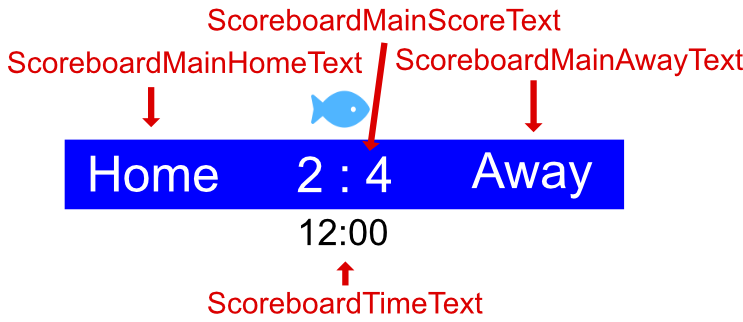

# Design a zagreus template
When creating a zagreus template the main visual elements are designed and created with the help of HTML, CSS and Javascript (JS). It is possible to integrate zagreus both in a simple template (just a static HTML file with some styling) but also in a more complex solution such as a React application.

In this section we will demonstrate how to use zagreus on a very simple template.

## Initial design

Create a new folder that will contain the template.

```shell
mkdir test-template
```
In the folder create a file called `index.html` with the following contents:

```html
<!DOCTYPE html>
<html lang="en">
    <head>
        <meta charset="utf-8"/>
        <title>zagreus template</title>
    </head>
    <body>
        <script src="http://localhost:58180/static/zagreus-runtime.js"></script>
    </body>
</html>
```
This file serves as the basis for our new template. It's just an empty page which loads the _zagreus runtime_ from the zagreus server. The _zagreus runtime_ is a script which will handle the communication with the zagreus server for you. It will make sure that the template announces itself to the server and can take commands such as updating a text or playing an animation. If you have configured the zagreus server to run on another machine or on a different port you will need to update the script source accordingly.

Next, add some markup to the HTML body:

```html
<body>
    <div id="root" data-zag="zagreus-container" class="zagreus-hidden">
        <div class="scoreboard" data-zag="Scoreboard">
            <div class="scoreboard-logo" data-zag="ScoreboardLogo">
                
            </div>
            <div class=""
            <div class="lower-third-stripe" data-zag="LowerThirdVerticalStripe"></div>
            <div class="title-container">
                <h1 data-zag="LowerThirdTitle">Title</h1>
                <h2 data-zag="LowerThirdSubtitle">Subtitle</h2>
            </div>
            <div>
                
                <p data-zag="LowerThirdRightAlignedText">Right 12</p>
            </div>
        </div>
    </div>
</body>
```

Create a new document in full HD resolution (1920x1080px) in Inkscape. Then, add a rectangle for the scoreboard background. To give the rectangle an ID in the SVG document open the _Object properties_ view in Inkscape. Under _ID_ it is possible to give any object an ID which will be present in the exported SVG. Name this rectangle _ScoreboardMainBackground_. Then, create another rectangle for the time and place it just below the first one. Name the second rectangle _ScoreboardTimeBackground_. To display the necessary text create four text elements and place and name them according to the picture below.
Usually it will make sense to group elements that belong together in a group since the group can be named. Select the text for the time and the time background and create a group (right click -> group). Then give the group the name _ScoreboardTime_. Do the same thing for the main background and the three text fields on it and name the group _ScoreboardMain_.



Luckily, Inkscape allows the user user to save the document directly as SVG. Save the document in the template project directory as _template.svg_.


## Build the template
Once you have saved the template as `template.svg` you are ready to build the zagreus template for the first time. Go back to your terminal open in the template project directory and build the template:
```
zagreus-generator build
```
If everything goes well this will create a sub directory named _build_ in which you will be able to find a packed version of the template (_template.zip_). This file can later be uploaded to the zagreus server to be played out.

## Play out the template on the server
At this point the template has a few visual elements but has no dynamic text nor any animations. Still, we can upload it to the zagreus server to test it. First, start the zagreus server if you haven't done so already. Open a a new terminal and execute:
```
zagreus-server
```
This will start the zagreus server on the default port. With the server running use the `upload` generator command to upload the template:
```
zagreus-generator upload
```
After a moment you should see a success message indicating that the template _my-template_ was uploaded to the server. If you go back to the browser and open a new tab with the URL http://localhost:58179/static/template/my-template, the template will open. Make sure that you the browser viewport (the visible area of the website) is 1920 by 1080 pixels or larger. If it isn't zoom out a bit. Only then you'll be able to see the full template.
By now you should be able to see the graphic you designed in the browser tab. As we haven't added any animation or interactivity yet there is not much more to see at the moment.

Next step: [Dynamic text](dynamic-text.md)
